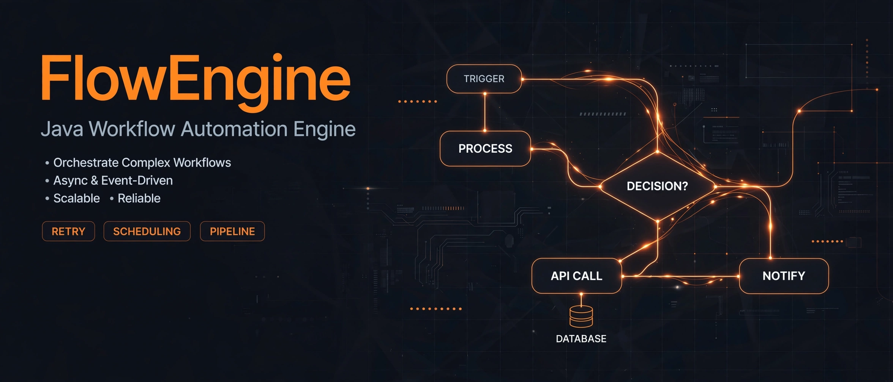

# FlowEngine

> ## Status: 🟢 Completed
>
> <progress value="90" max="100"></progress>
> **Progress: 90%** — Complete engine + dashboard; runs on any machine with Java.

<p align="center">
  
</p>


## What it is

FlowEngine is a miniature production-grade workflow automation engine written in **pure Java with zero external libraries** — no frameworks, no databases, no web stack. You define workflows as graphs of nodes (actions, conditions, delays, branches), and the engine executes them across a worker pool with retries, idempotency, failure injection, and a live Swing dashboard showing throughput, queue depth, and worker status in real time.

## What works (verified)

- ✅ Workflow engine — graph traversal with topological cycle detection, priority-queue scheduling — `engine/WorkflowEngine.java`
- ✅ Action executor with retry — exponential backoff with configurable cap — `engine/ActionExecutor.java`, `domain/RetryPolicy.java`
- ✅ Idempotency — sliding-window in-memory cache with TTL, so retried tasks don't double-apply — `engine/IdempotencyManager.java`
- ✅ Failure injection — chaos-style fault injection for resilience testing — `engine/FailureInjector.java`
- ✅ Event bus — multi-listener pub/sub with per-type routing — `event/EventBus.java`
- ✅ Worker pool — fixed thread pool with blocking-queue distribution — `concurrency/WorkerPool.java`
- ✅ Metrics — counters, time-series, live graphs (events/sec, active workflows, queue size) — `metrics/`
- ✅ Persistence — workflows + execution logs saved to disk — `persistence/PersistenceManager.java`
- ✅ Simulation — data generation and event streaming for load testing — `simulation/SimulationEngine.java`
- ✅ Real-time Swing dashboard — active/completed/failed counts, worker status, graphs — `ui/DashboardFrame.java`
- ✅ Expression evaluator for conditional nodes — `expression/ExpressionEvaluator.java`

> Verified by reading the full source tree (~4,400 lines across `domain/`, `engine/`, `event/`, `concurrency/`, `metrics/`, `persistence/`, `simulation/`, `ui/`). Java is not installed on this machine, so compilation was not executed here — the project's own build commands are reproduced below.

## Tech stack

| Layer | Tech |
|---|---|
| Language | Java 8+ (`java.base`, `java.desktop`, `java.util.concurrent` only) |
| UI | Swing/AWT dashboard |
| Concurrency | `ExecutorService`, `BlockingQueue` |
| Persistence | Flat files on disk |
| Dependencies | None |

## How to run

```bash
# Compile (no build tool needed)
javac -d out -sourcepath src src/com/flowengine/FlowEngine.java

# Run with 10 worker threads
java -cp out com.flowengine.FlowEngine

# Run with a custom worker count
java -cp out com.flowengine.FlowEngine 20
```

> Requires Java 8+. The dashboard is a desktop Swing window, so run it on a machine with a display.

## Screenshots

No screenshots ship with the repo. The banner above is the visual; the app opens a live Swing dashboard window on launch.

## What you can add more

- [ ] REST API — expose workflow submit/status over HTTP so non-Java clients can drive it
- [ ] Real database persistence — swap flat files for SQLite/Postgres
- [ ] Workflow DSL or JSON import — define workflows as files instead of code
- [ ] Authentication — the dashboard and engine currently have none
- [ ] Distributed workers — run worker pools across machines
- [ ] Export metrics to Prometheus — the metrics layer is in-memory only today

## Project structure

```
FlowEngine/
└── src/com/flowengine/
    ├── FlowEngine.java        # Entry point, wires everything together
    ├── domain/                # Workflow, nodes, connections, events, tasks, retry policy
    ├── engine/                # Execution engine, action executor, idempotency, failure injection
    ├── event/                 # Publish/subscribe event bus
    ├── concurrency/           # Worker pool, task distribution
    ├── expression/            # Condition expression evaluator
    ├── metrics/               # Counters, time-series, graph data
    ├── persistence/           # Workflow + execution log storage
    ├── simulation/            # Load-test data generation and event streaming
    └── ui/                    # Swing dashboard (frames, canvas, graph panels)
```

---
*README written after code audit on 2026-10-08.*
